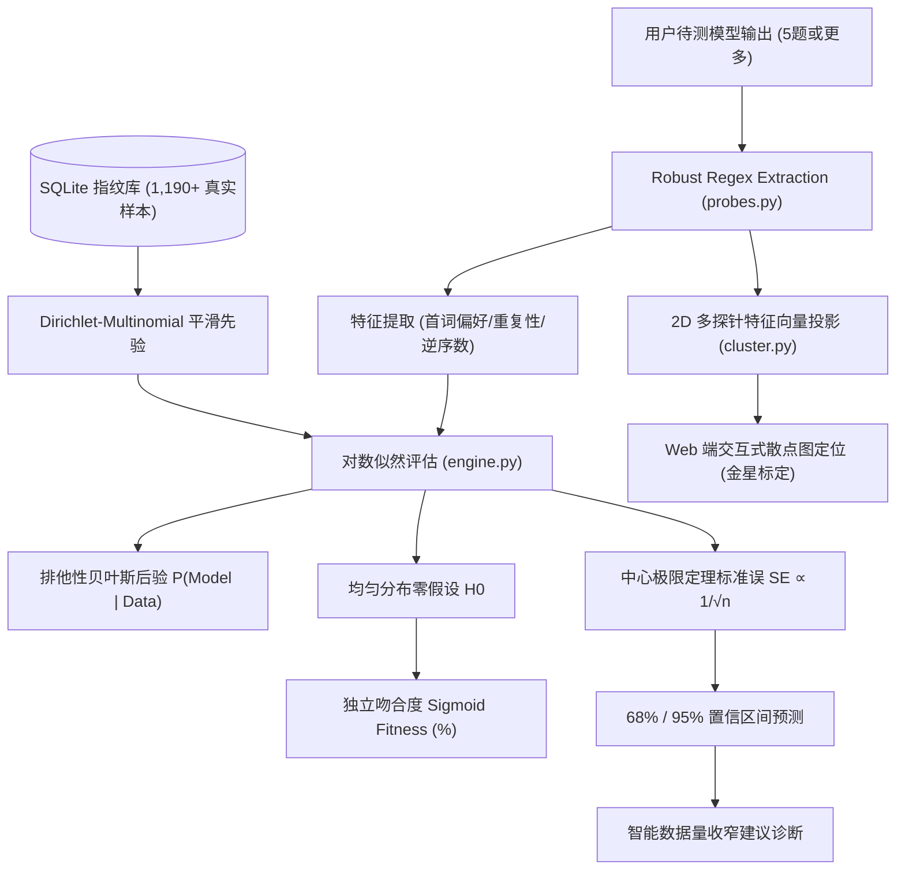

# StatLLM — Instructions for AI Coding Agents

本文件面向在 **StatLLM** 仓库中进行协作、研发、评测与维护的 AI Coding Agent（包括 Antigravity, Claude, Copilot, Trae, Cursor 等）。  
人类开发者与开源研究者请参阅 [README.md](README.md) 与 [CONTRIBUTING.md](CONTRIBUTING.md)。

---

## 1. Project Mission & Invariants (核心定位与不可破坏的契约)

StatLLM 是专注于**黑盒大语言模型统计归属鉴定与离散指纹溯源**的开放数理系统 (Black-Box LLM Statistical Fingerprinting & Bayesian Attribution System)。  
其核心差异化在于 **“利用人类直觉忽略但预训练模型固有的离散偏好（词元分布、组合排列、博弈转移），在不需要模型内部权重或 Logits 的前提下，仅凭多道精简探针即可实现极高置信度的黑盒模型溯源与真伪辨识”**。

### 核心不可违背契约 (Invariants)：

1. **基准指纹真实性守恒 (Zero-Synthetic Empirical Invariant)**：
   - 底库 `statllm.db` 中收录的官方模型基准样本**必须 100% 来源于真实模型 API 物理调用**。
   - **严禁**使用启发式规则或大模型自我虚构“幻觉指纹数据”直接写入 `samples` 与 `token_counts` 表。真实统计方差是贝叶斯对数似然鉴别的基石。

2. **黑盒非侵入溯源契约 (Black-Box Non-Intrusive Attribution)**：
   - 评测流程仅依赖公开输入 Prompt 与输出纯文本解析（Array Extraction）。
   - **绝不**假定服务商开放 Logprobs、Attention Weights、激活值或隐藏状态。

3. **双语隔离纯净度契约 (Strict Bilingual Separation Invariant)**：
   - Web 前端在 `lang=en`（英文模式）下，**严禁出现任何中文字符泄露**（包括图表 Tooltip、下拉框选项、动态诊断卡片、弹窗提示）。
   - 任何涉及前端 UI 或文案的改动，必须通过 `python scripts/audit_i18n.py` 自动化端到端审查（0 处字符泄露）。

4. **零私钥泄露契约 (Zero Secret Leakage Invariant)**：
   - **严禁**在任何脚本或源码中硬编码明文 API Key（如 `sk-or-v1-...`, `sk-...`）。
   - 所有自动化采样脚本统一采用 `os.environ.get("OPENROUTER_KEY", "")`，并在缺失时给出优雅退出提示。密钥统一在本地 `.env` 管理（已列入 `.gitignore`）。

5. **数据库 WAL 挂载同步契约 (SQLite WAL Checkpoint Invariant)**：
   - 在向 `statllm.db` 批量写入或恢复数据后，**必须执行 `PRAGMA wal_checkpoint(TRUNCATE)`**，将 WAL 日志完整刷写回主数据库文件，确保 Docker 容器内挂载能实时感知数据变更。
   - 每次底库模型或样本结构变更后，必须重新拟合 2D PCA 聚类投影器（`ClusterProjector(db).fit()`）。

---

## 2. Repository Layout (项目结构速查)

```text
StatLLM/
├── .github/workflows/          # GitHub Actions CI/CD 流水线 (ci.yml, docker.yml)
├── statllm/                    # 核心 Python 算法与数理引擎包
│   ├── probes.py               # 5 大离散数学探针定义与鲁棒正则解析器
│   ├── database.py             # SQLite 加权频次存储与预聚合统计层
│   ├── engine.py               # 贝叶斯对数似然、Fitness、中心极限定理置信区间收窄诊断
│   ├── cluster.py              # 2D PCA 降维与经验 Bootstrap 散点聚类投影器
│   ├── perturbations.py        # 工业级 Prompt 扰动引擎 (Persona, Chit-chat, Noise)
│   ├── archive.py              # 众包用户标注与评测归档流
│   ├── seed_data.py            # 离线回退与种子经验分布数据
│   └── cli.py                  # 终端命令行交互工具 (statllm eval/stats/probes)
├── web/                        # FastAPI 现代服务端与 Web 界面
│   ├── app.py                  # RESTful API 路由 (/api/evaluate, /api/models, /api/stats)
│   └── static/                 # 响应式纯双语 SPA (Tailwind CSS + Chart.js Canvas)
│       ├── index.html          # 单页应用与学术理论对比表格
│       └── app.js              # 动态森林图、2D PCA 交互、多语言字典系统
├── scripts/                    # 自动化评测、基准扩充与端到端审计工具集
│   ├── audit_i18n.py           # Playwright 端到端纯净双语无死角自动化审计
│   ├── expand_all_flagships_and_glm.py   # 顶级厂商旗舰模型全随机扰动批量采样
│   ├── onboard_meta13_and_gemini_latest.py# Meta 1.3、Gemini Pro、Gemma 4 接入脚本
│   └── collect_perturbed_data.py         # 标准化扰动采样基准工具
├── tests/                      # 单元与集成测试 (PyTest)
├── Dockerfile                  # 容器镜像构建文件
├── docker-compose.yml          # 本地容器化编排 (默认映射 8008 端口)
├── .env.example                # 环境变量配置模板
├── .editorconfig               # 编辑器格式化规范
├── .dockerignore               # 容器构建排除文件
├── AGENTS.md                   # AI Coding Agent 契约与操作规范 (本文件)
├── CONTRIBUTING.md             # 开发者贡献指南
├── SECURITY.md                 # 安全披露与漏洞策略
├── LICENSE                     # MIT 开源许可证
├── README.md                   # 英文旗舰项目介绍
└── README_CN.md                # 中文旗舰项目介绍
```

---

## 3. Essential Commands (核心研发与验证命令)

所有命令推荐在项目内置的 Python 虚拟环境中执行：

```bash
# 1. 运行核心单元测试
./.venv/bin/pytest tests/ -v

# 2. 运行 Playwright 双语纯净性端到端无死角审计
./.venv/bin/python scripts/audit_i18n.py

# 3. 校验数据库完整性与样本总量
./.venv/bin/python -c "
import sqlite3
conn = sqlite3.connect('statllm.db')
c = conn.cursor()
c.execute('PRAGMA integrity_check;')
print('Integrity:', c.fetchall())
c.execute('SELECT count(*) FROM samples;')
print('Total Samples:', c.fetchone()[0])
"

# 4. 刷新 WAL 日志并重新拟合 2D PCA 聚类
./.venv/bin/python -c "
import sqlite3
from statllm.database import Database
from statllm.cluster import ClusterProjector
with sqlite3.connect('statllm.db') as conn:
    conn.execute('PRAGMA wal_checkpoint(TRUNCATE);')
db = Database('statllm.db')
projector = ClusterProjector(db)
projector.fit()
print('PCA re-fitted with', len(projector.get_cluster_data()['clusters']), 'models.')
"

# 5. 重启本地 Docker 服务并检查状态
docker compose up -d --force-recreate
docker compose ps
curl -s http://localhost:8008/api/stats | jq .
```

---

## 4. Mathematical Architecture & Inference Flow



---

## 5. Agent Workflows: Adding New Models & Probes

### 5.1 接入新基座大模型
1. 在 `statllm.db` 中注册模型元数据（`name`, `display_name`, `provider`, `color`）。
2. 使用 `statllm.perturbations.apply_perturbation()` 对 5 个标准探针生成混合提示词（人设、多轮闲聊、长上下文噪声）。
3. 批量调用 API（温度在 $0.70 \sim 0.95$ 间抽样），记录 `prompt_tokens` 与 `completion_tokens`。
4. 执行 `PRAGMA wal_checkpoint(TRUNCATE)` 并重新拟合 PCA。
5. 运行 `pytest` 与 `audit_i18n.py` 确保各项测试 100% 通过。

### 5.2 扩展新离散数学探针
1. 在 `statllm/probes.py` 中继承 `Probe` 基类，实现 `prompt`、`parse(raw_text)` 与行为特征字典 `traits`。
2. 在 `PROBES` 注册表中添加新探针条目。
3. 在 `web/static/app.js` 的 `I18N` 字典中添加对应的英文与中文显示标签。
4. 运行 `tests/test_probes.py` 进行边界用例测试。
